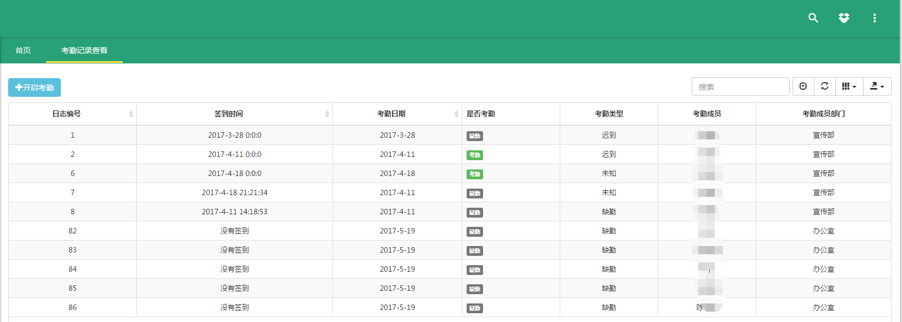
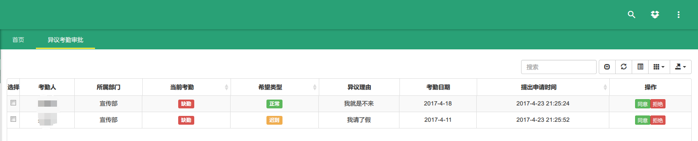
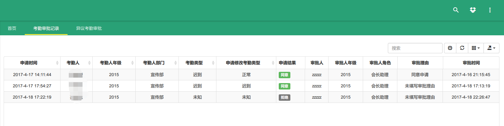
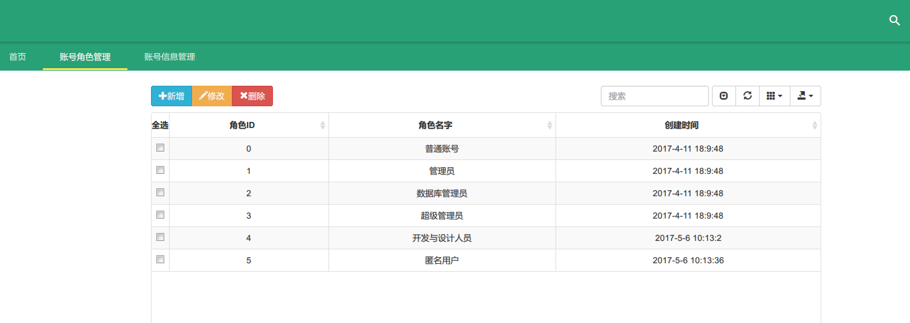
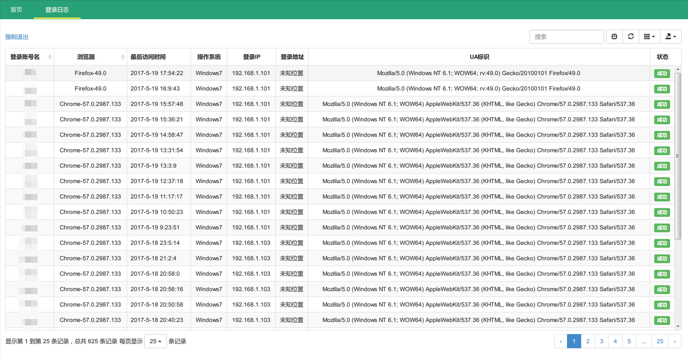
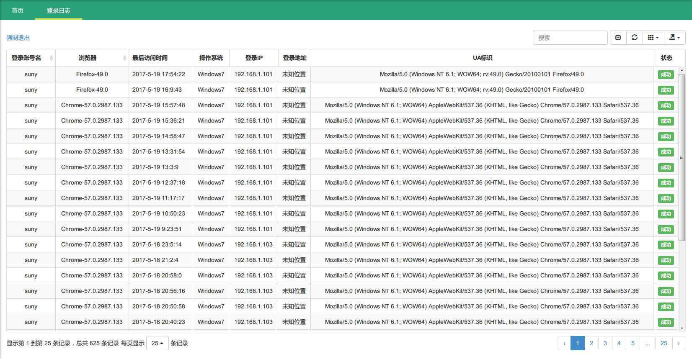
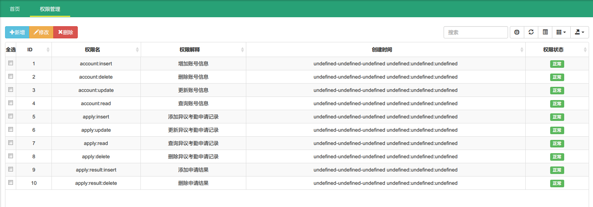
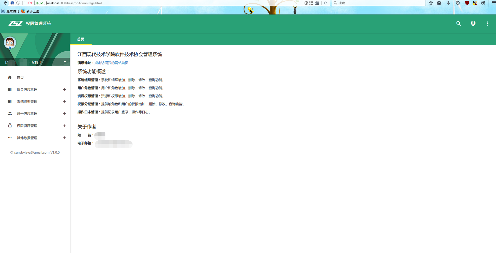

# manager
江西现代学院软件技术协会管理系统，采用SSM框架进行开发，功能正在开发中。。。。

## 项目的起因

   做这个项目的主要原因就是巩固下现有阶段所学的知识，知识点学太多了容易忘记。客观上就是在社团里面发觉有时候考勤是一件比较麻烦的事情，特别是像社团考勤需要用纸张进行填写，然后还需要人工去统计每次缺勤的人数或者是正常考勤的人数，最后到了一定阶段对缺勤次数过多的成员踢出协会。中间有一个比较大的工作量，利用现学的知识我觉得我们可以尝试去写一个半自动化基于网络的协会管理软件，可以减轻在管理方面的工作量。
   
   因为去年已经尝试写过一个类似的[基于SSH的社团管理系统](https://github.com/Sunybyjava/employeeManager)，所以这个项目应该来说有一部分是相类似的，写起来也更有思路，反正也是边做边学
   
## 项目环境搭建

### 生产环境
* **操作系统** : Ubuntu 17.04 
* **IDE** ：IntelliJ IDEA 2016.2.5 x64 像是个全家桶，很多工具都给你安装好了，像自带数据库连接工具，SSH连接工具等等，基本就是开箱即用，跟Eclipse相比的话各有各的好处
* **JDK** : JDK1.8 (务必使用1.8进行构建，否则将会构建失败)
* **Web容器** ： Tomcat 8.0
* **数据库** ：Mysql-5.6.17-winx64    轻量级的数据库
* **依赖管理工具** : Maven  挺好上手的一个工具，管理jar包真的很方便
*  **版本控制工具** : Git 
--- 
### 主要框架
* **Spring 4.3.6.RELEASE** : 差不多是必选的，全家桶   
  [Spring官方网站,里面的文档跟Demo是学习的最佳方法](https://spring.io/)  
  [Github工程，如果你有能力的也可以参与](https://github.com/spring-projects)
* **Springmvc 4.3.6.RELEASE**: 跟Spring可以无缝集成，比较的轻量灵活，支持Restful风格，只是浏览器目前有些请求不支持，可以用别的办法达到我们的目的。

  [官方英文文档,英语好的肯定没问题，建议阅读](https://docs.spring.io/spring/docs/current/spring-framework-reference/html/mvc.html)
  
*  **Mybatis 3.4.1** : 半自动的锋利匕首，可以自己自定义SQL语句，可能比Hibernate更容易入手  ，官方文档有五种语言版本，应该是全球各地的爱好者自发更新的  
[Mybatis官方中文文档](http://www.mybatis.org/mybatis-3/zh/)  
[Mybatis官方英文文档](http://www.mybatis.org/mybatis-3/)  
[Mybatis在Github上的项目](https://github.com/mybatis/)  
[整合Spring跟Mybatis的方法](http://www.mybatis.org/spring/zh/)  

*  **~~Shiro~~**: Apache基金会下的权限管理框架，比较容易扩展，使用也简单，不过官方的文档不是很友好  
[shiro官方站点](https://shiro.apache.org/) 

* **sf4j** :可以使用多种日志系统，无缝切换，使用的是 **log4j**，简单好用  
[sf4j官方站点](https://www.slf4j.org/)  
[log4j官方站点](https://logging.apache.org/log4j/)  

* **c3p0** : 优秀的开源数据库连接池，比较常用的  
[c3p0官方站点，比较简洁化](http://www.mchange.com/projects/c3p0/)

* **Jackson** ：Json转换工具，可以很轻松地实用  
[Github上的Jackson](https://github.com/FasterXML/jackson)  

* **junit** ：老牌的单元测试工具了，可以提高你的代码质量  
  [Github上的junit4工程](https://github.com/junit-team/junit4)  
  [junit官方站点](http://junit.org/junit4/)

* **gson** : Google出的一个新型的json转换工具  
[Github上的gson](https://github.com/google/gson)

* **poi** ：apache下开源工具，对微软的Office文档进行操作，比较常用的应该就是操作Excel文档了   
[Apache官方的POI使用文档文档](https://poi.apache.org/)

* **Apache下的一些好用的工具** :这里就不一一列举了，像文件上传之类的

* **mybatis-generator-maven-plugin** ：mybatis官方出的一个工具，可以自动对数据库表产生实体类，mapper接口文件，mapper.xml文件以及一些常用的查询语句，提高你的开发效率，虽然IDEA自带了一个自动生成工具  
[插件官方地址,介绍的已经很明白了，建议Maven环境下使用](http://www.mybatis.org/generator/running/runningWithMaven.html) 

* 项目中使用的jar包可以在pom.xml文件中查看  

### 前端方面

* **整个后台模板是使用Github上大神的开源项目,基础页面建立在开源项目的基础之上，按照自己的需要对项目进行了一部分的修改操作**

   [基于bootstrap实现的响应式Material Design风格的通用后台管理系统](https://github.com/shuzheng/zhengAdmin)

* **Jquery** ：跨浏览器的JavaScript函数库，简化HTML跟JavaScript之间的操作，很简洁的代码就可以写出好看的效果  

   [官网下载，有文档，有Demo](https://jquery.com/)
   
* **Bootstrap** : Twitter推出的一个用于前端开发的开源工具包，项目中基本都是要依赖Bootstrap

  [中文官网，好像也是爱好者自己翻译的](www.bootcss.com/)
* **angular**：这是后台模板使用到的，用于构建移动应用和桌面Web应用的开发平台.  
  [英文官网](https://angularjs.org/)
  [中文官网](https://angular.cn/)

* **Layer** ：一款口碑极佳的web弹出层组件，只是用了弹出层，用很少的代码写出的弹出层很美观  
 [官方弹出层网站，很良心的一个站点](layer.layui.com/)   
[官方网站，不只是弹出层，还有别的像分页，日期，富文本等等一系列的组件](https://www.layui.com/)

* **bootstrap-table** ：看名字就知道跟Bootstrap肯定有很大的关系了，一个表格组件，很方便就可以构建出漂亮的表格，再配上Bootstrap的字体图标真的很好看  
[中文官网，看名字好像是国人开发的](bootstrap-table.wenzhixin.net.cn/zh-cn/)

* **fullPage** ：看名字就知道了，全屏的插件，依赖于Jquery

* **zTree** ：一个树形插件，常用语权限控制的时候显示权限  
 [中文官网，很给力，作者设置给出了他用Java代码跟这个结合的例子](www.treejs.cn/)

* **material-design-iconic-font** ：字体图标  
  [https://github.com/zavoloklom/material-design-iconic-font](https://github.com/zavoloklom/material-design-iconic-font)  
* **Waves** ： 点击效果插件,类似于那种波浪的效果   
 [https://github.com/fians/Waves](https://github.com/fians/Waves)  

* **Select2** ： 选择框插件，类似缩放的效果   

   [https://github.com/select2/select2](https://github.com/select2/select2)

* **jquery-confirm** ： 弹出窗口插件  
 [https://github.com/craftpip/jquery-confirm](https://github.com/craftpip/jquery-confirm)

* 等等系列插件可以查看src\main\webapp\plugins，这里是项目中大部分插件存放的地方

---


### 目前的效果图


- 考勤记录页面  


- 有异议的考勤记录申请   

 
- 审批结果页面  

  
- 成员管理页面  


- 账号角色管理页面  


- 登录日志查看界面  


- 操作日志查看界面  

  
- 权限分配页面   


---
## 项目跑起来

### 下载  

`Download Zip`或者`git clone`
``` shell
	git clone https://github.com/Sunybyjava/manager.git
```

### 快速开始   

#### 导入

建议使用IDEA，eclipse也没问题
新建或者配置一个mysql数据库，根据数据库信息修改`src/main/resources/db.properties`文件。注意修改的有账号密码，以及连接的数据库名  

建议导入IDEA中运行，***请注意JDK必须使用1.8***，项目中很多有些地方使用1.8的语法，低于**1.8**将会报错。Eclipse也可以Import Project后修改部分属性达到一样的效果  

使用Maven解决依赖，建议修改Maven在线仓库地址为阿里云源，国内的速度还是挺不错的:
```
  <mirror>
        <id>nexus-aliyun</id>
        <mirrorOf>*</mirrorOf>
        <name>Nexus aliyun</name>
        <url>http://maven.aliyun.com/nexus/content/groups/public</url>
    </mirror> 
```

#### 数据库的创建
数据库暂时分为15张表，将会根据项目的使用动态添加数据库表

##### 快速导入数据库 (推荐)
在根目录下[sql](sql/)文件夹下有一个数据库脚本，使用Mysql控制台或者第三方工具直接导入到数据库就可以了，这里数据库的名字叫做**manager**，

##### 自己手动导入数据库


### 运行

  经过前面的步骤后，应该是运行起来是没有问题的，部署到你的**Tomcat**里面去吧，如果部署成功的话，在浏览器里面输入登录页面的地址，在我这里登录地址是 
  > ***http://localhost:8080/base/loginPage.html**     
  
  如果你有项目名的话，请在域名**/base**前面添加你的项目名，也就是
  
> http://localhost:8080/项目名/base/loginPage.html,如果没问题的话你应该就会看到登录页面了

- 登录页面的效果图  


#### 添加数据库信息
1. 首先你要想登录的话你要往数据库里面添加账号信息，往**Account**表中添加一条信息，这里有一份实例的SQL语句，你可以直接复制过去使用，这里往数据库里面插入了一个账号为【test】，密码为【test】，其他的信息你可暂时不用关注，然后插入成功后你就可以输入账号密码进行登录了，请注意验证码的填写
```
INSERT INTO `manager`.`account`(`account_id`,`account_name`,`account_password`,`account_phone`,`account_email`,`account_status`,`account_role_id`,`account_member_id`) VALUES ( NULL,'test','test','12345678901',NULL,'1','0',NULL);
````


- 登录后的主页面  



---

#### 后续你应该做的事情

##### 继续往数据库里面添加数据，已达到测试的目的

根据每张数据库表的不同作用，你可以添加相对应的数据

- 你应该添加【协会成员】的信息给你刚刚创建的账号，数据库表为```member```这里我们创建了一个成员信息，成员的名字为【测试账号】，班级为【未知班级】，性别为【1也就是男】，届级【2016，也就是2016届】，成员的状态【1，也就是正常】，部门【0，看你对应的部门是哪个】，成员的角色【0，也是看你对应的角色是什么】，成员的管理员是【NULL,也就是暂时没有管理员】
```
INSERT INTO `manager`.`member`(`member_id`,`member_name`,`member_class_name`,`member_sex`,`member_grade_number`,`member_status`,`member_department_id`,`member_role_id`,`member_manager_id`) VALUES ( NULL,'测试账号','未知班级','1','2016','1','0','0',NULL);
```
- 上一条语句你可能执行不成功，原因呢就在于有外键约束，你要插入的部门编号为【0】，但是你部门表【department】中添加一条数据：

```
INSERT INTO `manager`.`department`(`department_id`,`department_name`) VALUES ( '0','测试部门');
```
-  然后你还要新建一条成员角色，往成员角色表【member_roles】添加一条数据：
```
INSERT INTO `manager`.`member_roles`(`member_role_id`,`member_role_name`) VALUES ( '0','测试成员角色');

```
- 然后你再执行第一条插入成员信息的**SQL**语句应该是成功的，这时候你应该把你的成员信息绑定到账号信息里面去，我们把一开始插入的账号信息中空出来的成员信息给绑定上去：
```
UPDATE `manager`.`account` SET `account_member_id`='你的成员信息主键ID' WHERE `account_id`='你的账号信息表中的主键ID';

```
- 这时候你的账号跟成员就绑定在一起了，你需要继续给你的数据库里添加各种信息，你需要查看哪个功能的信息你就要往对应的数据库表里面插入数据

## 项目中的一些注意事项
 
### 项目中的考勤操作流程

  在设计考勤流程的过程中，查阅网上资料可能直接讲出来的例子比较少，然后在图书馆找到一本[轻量级Java EE企业应用实战 Struts 2+Spring 4+Hibernate整合开发](http://www.phei.com.cn/module/goods/wssd_content.jsp?bookid=41105)，  在阅读到最后一章的时候，我发现刚好就有一章是讲解企业考勤系统设计的，考勤原理就是每次要考勤的时候，就给所有需要考勤的员工插入一条考勤记录，然后员工在进行打卡的时候就是进行一个修改考勤类型操作，如果员工没有打卡的话，当天考勤就属于缺勤。员工在进行打卡的时候按照打卡的时间进行判断考勤的类型，项目中的考勤流程也是仿照这个理念的
  
  项目中考勤的流程在[\src\main\java\com\suny\association\controller\PunchRecordController.java](\src\main\java\com\suny\association\controller\PunchRecordController.java)文件中，一定要管理员首先开启了开启签到，开启签到的地方位于```协会信息管理>考勤记录查看```里面有一个**开启考勤**按钮,也就是执行```insert```方法给所有需要考勤的成员添加一条缺勤记录后，成员才可以进行考勤，否则会提示未开启考勤，成员打卡按钮在主页面点击展开按钮后会出现```今日签到```，点击就可以进行打卡签到了  
  
  
### 项目中的全局异常处理

  项目中异常处理都是使用[\src\main\java\com\suny\association\exceptionSolver\SimpleMappingExceptionSolver.java](C:\workspace\manager\src\main\java\com\suny\association\exceptionSolver\SimpleMappingExceptionSolver.java)进行处理，首先实现了SpringMvc的一个异常处理器
  ```
class SimpleMappingExceptionSolver implements HandlerExceptionResolver
  ```
    然后根据请求的划分进行不同的处理，假如是普通的请求的话，发生了异常就重定向到一个错误显示的页面，如果是一个**AJAX**请求的话，发生了异常就返回一个异常的**JSON**数据，如果抛出异常的地方传入了异常的原因，就是用传入的异常原因作为返回的**JSON**数据，如果不能判断异常的原因的话就返回一个固定的**JSON**数据:
```
status :999
errorMessage : 系统异常
```
  
###  项目中的类似于数据字典  
  
    没有使用动态的数据库读取数据字典，而是使用枚举封装了很多数据，到了后期不是很好维护，位于[\src\main\java\com\suny\association\enums\BaseEnum.java](\src\main\java\com\suny\association\enums\BaseEnum.java)中,注意切勿修改```toString()```方法，否则抛出了异常的话异常没办法解析**status**状态码，异常解析状态码的工具类在[SimpleMappingExceptionSolver](\src\main\java\com\suny\association\exceptionSolver\SimpleMappingExceptionSolver.java)中的```gerErrorCode()```方法中，就是通过枚举的```toString()```方法截取状态码
```
private int gerErrorCode(Exception ex) {
        String errorMessage = ex.getMessage();
        int afterErrorCode = errorMessage.lastIndexOf(',');
        String errorCode = errorMessage.substring(5, afterErrorCode);
        return Integer.parseInt(errorCode);
    }
```
###  项目中的权限控制或者是验证登录时使用原生过滤器来写的  
   
项目一开始是使用**Shiro**来进行权限控制的，后面碰到一个bug未能解决，所以就只能自己来写了
    过滤器位于[\src\main\java\com\suny\association\filter\PermissionFilter.java](\src\main\java\com\suny\association\filter\PermissionFilter.java)中，这里放行了几个不用权限就可以访问的页面，然后根据【access_url_permission】表中的数据判断当前访问的连接是否需要权限，如果需要权限，就从【permission_union_role】表中读取当前登录用户的权限，如果不满足权限就跳转到提示无权限页面，这里可以debug打断点进去查看流程。


  - 
  

## 项目中的一些规范
  不久前国内Java开源比较多的阿里出了本[阿里巴巴Java开发手册](https://yq.aliyun.com/articles/69327)，毕竟大厂里面使用的标准，我们也可以参考其中的规范，约束自己的代码  
  
 #### 例如在项目中：


- 项目使用Maven构建，约定大于配置  

- 在类跟方法上面写注释，注释要比较的清晰易懂

- 类名采用驼峰式书写，方法名采用首字母小写

- 尽可能把长的代码拆分成易读的短小代码

- 能复用的代码抽取成静态方法重复使用

- 源文件编码格式为`UTF-8`

- service类，放在在叫名`service`的包下，接口以`I`开头，例如`IAccountService`，实现类以`Impl`结尾，如`AccountServiceImpl`

- controller类，放在在以`controller`结尾的包下，类名以Controller结尾，如`AccountController.java`，并继承`BaseController`

- mapper.xml，需要在名叫`mapper`的包下，并以`Mapper.xml`结尾，如`AccountMapper.xml`

- mapper接口，需要在名叫`mapper`的包下，并以`Mapper`结尾，如`AccountMapper.java`

- model实体类，需要在名叫`pojo`的包下，命名规则为数据表转驼峰规则，如`Account.java`

- spring配置文件，命名规则为`applicationContext-*.xml`

- springmvc配置加到对应模块的`applicationContext-SpringMVC.xml`文件里

- 配置文件放到`src/main/resources`目录下

- 静态资源文件放到`src/main/webapp/resources`目录下

- jsp文件，需要在`/WEB-INF/jsp`目录下

- `RequestMapping`和返回物理试图路径的url尽量写全路径，如：`@RequestMapping("/account")`、`return "/account/index"`

- `RequestMapping`指定method


#### 当然网上也有一些Java代码的规范，我们也可以参考
- [Sun公司在1999年4月20日更新更新的英文规范](http://www.oracle.com/technetwork/java/javase/documentation/codeconvtoc-136057.html)  
- [国人翻译的Sun公司中文语言规范](https://waylau.gitbooks.io/java-code-conventions/)
- [Google Java编程风格指南](http://www.hawstein.com/posts/google-java-style.html)
- [IBM巨头提出的参考标准](https://www.ibm.com/developerworks/cn/java/standards/)
## 推荐的一些博客以及参考资料

在做项目的过程中，需要学习很多没有接触过的知识，同时也需要不断地完善已经有认识但是不是很熟悉的技术知识点，于是网上一些论坛，博客分享了很多高质量的内容

### 首先推荐的是京东大神涛哥的跟我学系列，跟我学系列简单易学，并且在Github上有例子可以下载运行，深入浅出易懂

- [跟我学Shiro目录贴](http://jinnianshilongnian.iteye.com/blog/2018398 "跟我学Shiro目录贴")

- [跟我学SpringMVC目录汇总贴](http://jinnianshilongnian.iteye.com/blog/1752171 "跟我学SpringMVC目录汇总贴")

### 做权限控制的时候搜索到的一些在ITeye论坛上的好帖子


- [权限控制的讨论](http://www.iteye.com/magazines/82 "ITeye论坛关于权限控制的讨论")  
- [RBAC新解：基于资源的权限管理(Resource-Based Access Control)](http://globeeip.iteye.com/blog/1236167 "RBAC新解：基于资源的权限管理(Resource-Based Access Control)")
 - [java poi 读取Excel](http://jynine.iteye.com/blog/1826262)
- [spring shiro权限注解方式验证](http://zzc1684.iteye.com/blog/2188152)
- [SpringAOP拦截Controller,Service实现日志管理(自定义注解的方式)](http://tiangai.iteye.com/blog/2103708)
- [用枚举来处理java自定义异常](http://www.iteye.com/topic/1137167)
- [java 判断对象是否为空](http://hw1287789687.iteye.com/blog/1936364)
- [SpringMVC深度探险](http://www.iteye.com/blogs/subjects/springmvc-explore)


### 不得不说，stackoverflow上很多方面都比国内很多复制内容的论坛好多了，气氛相对较好的地方
- [Java8使用LocalDateTime，Mybatis无法识别的解决办法](http://stackoverflow.com/questions/25113579/java-8-localdate-mapping-with-mybatis) 
- [这里是关于Java的一个标签体，里面介绍的是关于Java 的内容](https://stackoverflow.com/tags/java/info)

### 在使用Bootstrap-table时，在网站找到的比较优质的博客例子，很详细
- [JS组件系列——表格组件神器：bootstrap table](http://www.cnblogs.com/landeanfen/p/4976838.html)  
- [JS组件系列——表格组件神器：bootstrap table（二：父子表和行列调序）](http://www.cnblogs.com/landeanfen/p/4993979.html)
- [JS组件系列——表格组件神器：bootstrap table（三：终结篇，最后的干货福利）](http://www.cnblogs.com/landeanfen/p/5005367.html)  
#### 同时官网的例子也是挺详细的  
- [Bootstrap Table Demo](http://issues.wenzhixin.net.cn/bootstrap-table/index.html)

- [Bootstrap Table API](http://bootstrap-table.wenzhixin.net.cn/zh-cn/documentation/)

- [Bootstrap Table源码](https://github.com/wenzhixin/bootstrap-table)
### 一些在项目中很受用比较零碎的博客
- [spring MVC 的MultipartFile转File读取](http://www.cnblogs.com/hahaxiaoyu/p/5102900.html)  
- [在filter里注入被注解的bean？](https://www.zhihu.com/question/22977026)
- [ JavaWeb--Servlet过滤器Filter和SpringMVC的HandlerInterceptor（Session和Cookie登录认证）](http://blog.csdn.net/jack__frost/article/details/71158139)
- [shiro 自定义过滤器如何当无权限时返回json字符串](http://bbs.csdn.net/topics/390939739)
- [ BootStrap--具有增删改查功能的表格Demo](http://blog.csdn.net/wangmei4968/article/details/48437175)
- [ java web简单权限管理设计](http://blog.csdn.net/zwx19921215/article/details/44467099)


## 写在最后
 
可能因为自身技术能力的问题，有些地方设计的有缺陷请谅解，如果您偶然看到了这个项目，并且对项目中存在的问题有所了解或者有不完善的地方，欢迎您发issue或者电子邮箱[sunybyjava@gmail.com](sunybyjava@gmail.com)帮助我完善这个项目我将万分感谢！ 


